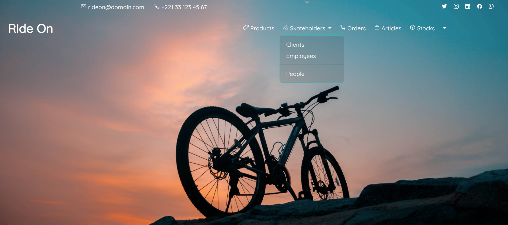
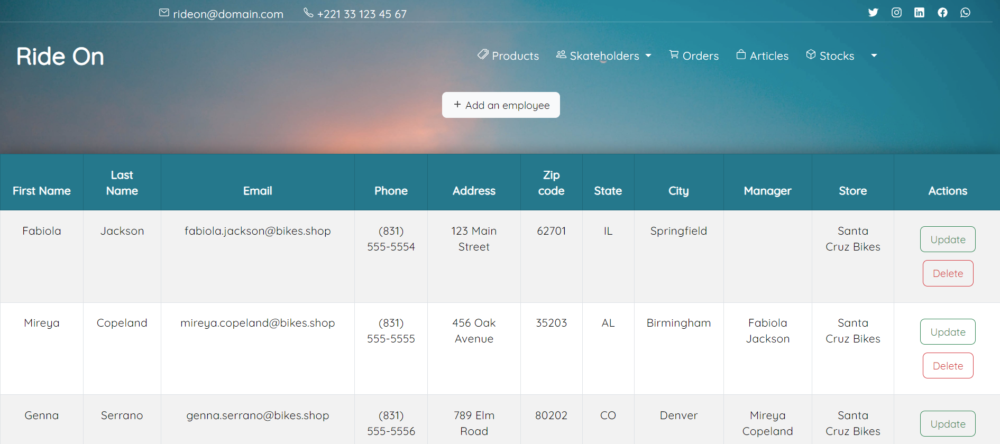
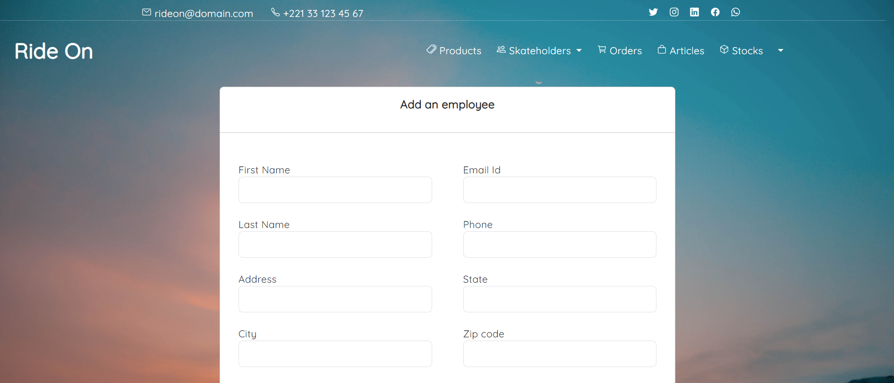

# Ride On

Welcome to _Ride On_, your one-stop destination for all your bicycle and bike needs. Whether you're a casual rider or a serious cyclist, we've got you covered with a wide range of high-quality bicycles and bikes. This readme file will provide you with all the information you need to understand and use our website effectively.







## Table of Contents

- [Introduction](#introduction)
- [Getting Started](#getting-started)
  - [Prerequisites](#prerequisites)
  - [Installation](#installation)
- [Usage](#usage)
  - [Development Server](#development-server)

## Introduction

_Ride On_ is an Angular-based (Angular version of Two wheelers) website designed to provide a seamless shopping experience for bicycle and bike enthusiasts. Our platform offers a user-friendly interface where you can browse, search your favourite bicycles and bike accessories. Here are some key features of our website:

- **Wide Selection**: We offer a diverse range of bicycles, including mountain bikes, road bikes, hybrid bikes, and more, catering to riders of all types and preferences.

- **Easy Navigation**: Our intuitive navigation system allows you to quickly find the products you're looking for, with filters to refine your search.

- **Detailed Product Pages**: Each product page provides comprehensive information about the bicycle or bike accessory, including specifications, pricing, and customer reviews.

- **Secure Checkout**: We prioritize your security and offer a secure and hassle-free checkout process, ensuring your personal and payment information is safe.

- **Responsive Design**: _Ride On_ is designed to be accessible on various devices, from desktops to mobile phones, providing a consistent user experience.

## Getting Started

### Prerequisites

Before you can run _Ride On_ locally, you need to have the following software installed on your system:

- [Node.js](https://nodejs.org/) (LTS version recommended)
- [Angular CLI](https://angular.io/cli)

### Installation

1. Clone the _Ride On_ repository to your local machine:

```shell
git clone https://github.com/yourusername/ride-on.git
```

2. Navigate to the project directory:

```shell
cd ride-on
```

3. Install the project dependencies using npm:

```shell
npm install
```

## Usage
### Development server
To run the development server and access _Ride On_ in your browser, use the following command:

```shell
ng serve
```
Navigate to http://localhost:4200/ in your web browser to start using _Ride On_.